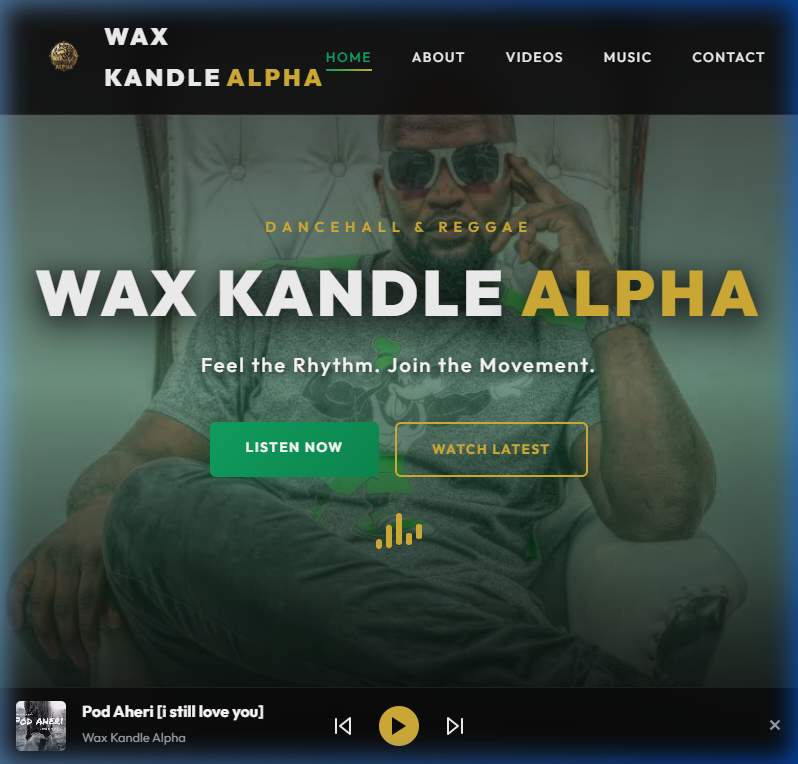

# 🎤 Wax Kandle Alpha – Official Artist Platform

  
  
  

## 🖼️ Live Preview
[View Live Site](https://alpha-music-one.vercel.app)

This project is a high-end web platform built to showcase and promote the music, brand, and digital presence of **Wax Kandle Alpha**, a Kenyan Reggae and Dancehall artist.

## 🚀 Overview
The platform serves as a central hub for fans to discover music, watch latest releases, explore artist content, and connect directly with the artist.

## 🛠️ Tech Stack

  
  
  
  
  
  

## 📂 Key Features
- 🎹 **Persistent Audio Player**: Listen to tracks while browsing.
- 📉 **Audio Visualizer**: Dynamic animated bars in the hero section.
- 🎥 **Embedded YouTube content**: Integrated latest music videos.
- 📱 **Responsive Design**: Optimized for mobile and desktop.
- 🔗 **Social Media Integration**: Direct links to all major streaming platforms.
- ⚡ **Database Driven**: All content is now fetched live from the Supabase API once deployed.

## 📄 License
This project is for educational and promotional purposes.

---

## 👨‍💻 Developer
Built by **Developer Protus Junior** ([github.com/juniorprotus](https://github.com/juniorprotus))  
Passionate about building digital platforms for artists and creators.
